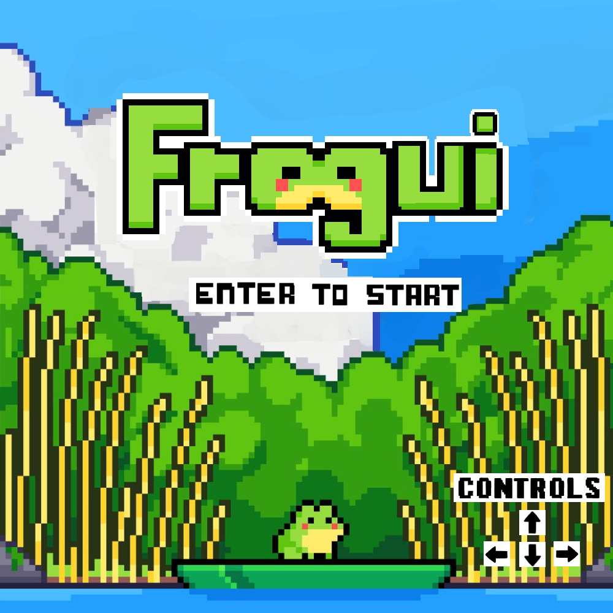
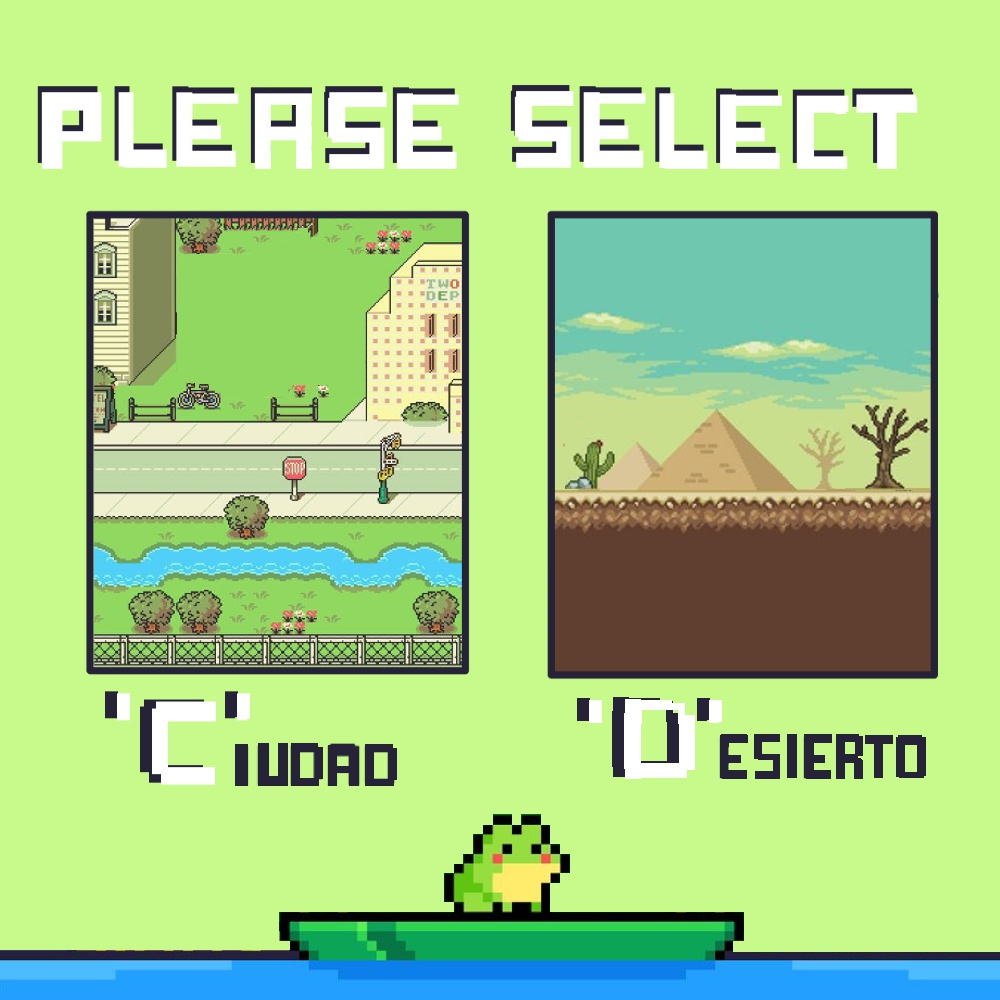

# Frogui game

## Capturas

## Reglas de Juego / Instrucciones
Controla a una rana que debe cruzar varios niveles llenos de obstáculos para alcanzar sus metas. Cada nivel tiene dos o tres objetivos que la rana debe alcanzar para desbloquear el siguiente nivel.
Ayuda a la rana a llegar a cada objetivo mientras evitas los peligros en el camino y recolectas puntos!

## Equipo de desarrollo

- Thiago Mutuverria
- Alina Marquez
- Macarena Lopez
- Maite Ponce
- .
- .
  
## Otros

- POO 1, UNAHUR.
- Versión de wollok: 3.0.0
- Una vez terminado, no tenemos problemas en que el repositorio sea público.

